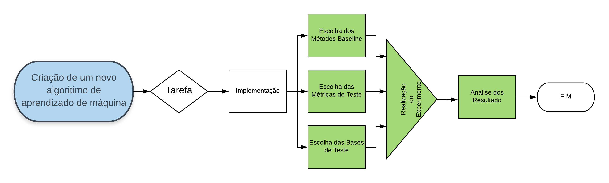

```{r setup, include=FALSE}
knitr::opts_chunk$set(echo = FALSE)
```

# Introdução

## Introdução
### Tópicos
- O processo de aprendizado
- Objetivos do MLAT
- Prática
- Futuras Melhorias

# O processo de aprendizado

## O processo de aprendizado
### Porque do Aprendizado
- Resolver Problemas difíceis para o humano
- Aprendizado não algorítmico
- Grande volume de dados disponíveis
- Automatizar tarefas humanas
- Obter performasse melhor que humanos

## O processo de aprendizado
### Criação de novos modelos
- Melhoria de modelos existentes
- Especialização dos modelos
- Novas tarefas de aprendizado
- Novos critérios de aprendizado

## O processo de aprendizado
### Criação de novos modelos



# Objetivos do MLAT

## Objetivos do MLAT
### Criação de novos modelos
- Automatizar o processo de benchmarking na criação de modelos
- Padronizar os benchmarks
- Facilitar ciclo de desenvolvimento do projetista

## Objetivos do MLAT
### Facilidades do Pacote
- Dados
- Modelos
- Métricas
- Execução dos Testes
- Testes de Hipótese


## Objetivos do MLAT
### Entradas do Usuário


# Prática

## Prática
### Pacotes Necessário
- nnet
- class
- ridge
- e1071
- dplyr
- tidyr
- scmamp


## Prática
### Instalação
```{r, eval = FALSE, echo = TRUE}
install.packages("devtools")
library('devtools')
devtools::install_github(repo = 'PauloCirino/MLAT')
library('MLAT')
```

```{r, eval = TRUE, echo = FALSE}
library('MLAT')
```


## Prática
### Criando um novo modelo
```{r, eval = TRUE, echo = TRUE}
MyNewAlgoFunc <- function(X_train, Y_train, X_test, k) {
  Y_hat <- numeric()
  for (i in 1:nrow(X_test)) {
    x_iter <- X_test[i,]
    distVet <- apply(X_train, 1, function(x) {
      sum(abs(x_iter - x))
    })
    Y_iter_vet <- Y_train[order(distVet)] [1:k]
    Y_iter_aux <- numeric()
    for (j in 1:k) {
      Y_iter_aux <- append(Y_iter_aux,
                           rep(Y_iter_vet[j],
                               k - j + 1))
    }
    unique_y <- unique(Y_iter_aux)
    aux_Table <- tabulate(match(Y_iter_aux,  unique_y))
    Y_hat[i] <- unique_y[which.max(aux_Table)]
  }
  Y_hat
}
```


## Prática
### Criando um novo modelo
```{r, eval = TRUE, echo = TRUE}
newAlgoInStandarts <- MLAT::CreateAlgo(
  algoName = 'KNN Mahalanobis Ponderado',
  algoFun = MyNewAlgoFunc,
  task = 'MultClass',
  paramList = list(k = 2:10) )
```

## Prática
### Modelos do Pacote
```{r, eval = TRUE, echo = TRUE}
algoList <- MLAT::GetAllMultClassAlgo()
sapply(algoList, function(x){x[['algoName']]})
names(algoList[[1]])
```

## Prática
### Um modelo já implementado
```{r, eval = TRUE, echo = TRUE}
algoList[[1]][['algoFun']]
```

## Prática
### Um modelo já implementado
```{r, eval = TRUE, echo = TRUE}
algoList[[1]][['task']]
algoList[[1]][['paramList']]
```

## Prática
### Dados
```{r, eval = TRUE, echo = TRUE}
MLAT::GetDataSetsNames(task = 'MultClass')
```

## Prática
### Métricas
```{r, eval = TRUE, echo = TRUE}
MLAT::GetMetrics(task = 'MultClass')
```

## Prática
### Execução dos Testes
```{r, eval = FALSE, echo = TRUE}
algoList[[length(algoList) + 1]] <- newAlgoInStandarts
resultTable <- MLAT::RunTests(
  cmpTestsFuncsList = algoList,
  task = 'MultClass', 
  dataSetNames = MLAT::GetDataSetsNames(task = 'MultClass'), 
  metrics = MLAT::GetMetrics(task = 'MultClass'), 
  nTestsPerParam = 10, 
  splitPerc = 0.7, 
  verbose = TRUE)
```

## Prática
### Execução dos Testes
```{r, eval = TRUE, echo = FALSE, cache = TRUE, warning = FALSE}
MLAT::RunTests(
  cmpTestsFuncsList = list(algoList[[1]], algoList[[2]]),
  task = 'MultClass', 
  dataSetNames = MLAT::GetDataSetsNames(task = 'MultClass')[1], 
  metrics = MLAT::GetMetrics(task = 'MultClass'), 
  nTestsPerParam = 5, 
  splitPerc = 0.7, 
  verbose = TRUE)
```

## Prática
### Testes de Hipótese
```{r, eval = TRUE, echo = FALSE, include = FALSE}
resultTable <- readRDS(file = './data/resultTable.rds')
```

```{r, echo = TRUE, incle = FALSE, warning = FALSE, message = FALSE}
hypotessesTestResult <- MLAT::HypotessesTest(
  resultTable = resultTable,
  testingMetric = 'F1 Macro',
  method = 'friedman',
  reductionMethod = 'mean',
  reductionOrder = 'max',
  alpha = 0.05)
```

## Prática
### Testes de Hipótese
```{r, echo = TRUE, incle = FALSE, warning = FALSE, message = FALSE}
names(hypotessesTestResult)
hypotessesTestResult$alpha
hypotessesTestResult$test
```

## Prática
### Testes de Hipótese
```{r, echo = TRUE, incle = FALSE, warning = FALSE, message = FALSE, fig.height = 3}
hypotessesTestResult$image
```

## Prática
### Testes de Hipótese
```{r, echo = TRUE, incle = FALSE, warning = FALSE, message = FALSE}
hypotessesTestResult$reducedTable
```

## Prática
### Testes de Hipótese
```{r, echo = TRUE, incle = FALSE, warning = FALSE, message = FALSE}
hypotessesTestResult$pValueTable
```


# Futuras Melhorias
## Futuras Melhorias
### Curto Prazo
- Instalação automática de pacotes
- Adição de bases de dados
- Adição de modelos
- Gravação parcial de resultados em disco

### Médio Prazo
- Vignettes
- Demos
- Summaries dos resultados
- Gráficos dos resultados

## Futuras Melhorias
### Longo Prazo
- Permitir usuário inserir bases de dados
- Fazer parâmetrização por base de dados
- Salvez parâmetrização e seus resultados
- Utilização de metodos S3

# Extra
## Extra


