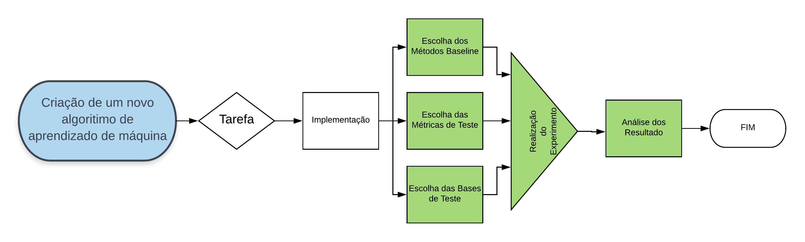
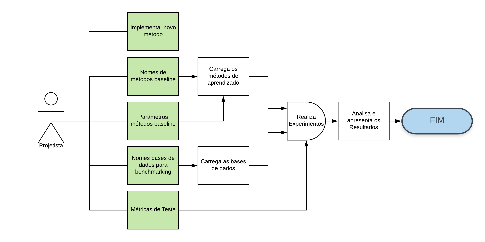

Machine Learning Automated Model Comparison - MLAT
========================================================
author: Paulo Cirino Ribeiro Neto
date: 28/07/2018
autosize: true

Introdução
========================================================
**Tópicos**
- O processo de aprendizado
- Objetivos do MLAT
- Prática
- Futuras Melhorias

O processo de aprendizado
========================================================
**Porque do Aprendizado**
- Resolver Problemas difíceis para o humano
- Aprendizado não algoritmico
- Grande volumes de dados disponíveis
- Automatizar tarefas humanas
- Obter performace melhor que humanos

O processo de aprendizado
========================================================
**Criação de novos modelos**
- Melhoria de modelos existentes
- Especialização dos modelos
- Novas tarafas de aprendizado
- Novos critérios de aprendizado

O processo de aprendizado
========================================================
**Criação de novos modelos**



Objetivos do MLAT
========================================================
- Automatizar o processo de benchamarking na criação de modelos
- Padronizar os benchamarks
- Facilitar ciclo de desenvolvimento do projetista

Objetivos do MLAT
========================================================
**Facilidades do Pacote**
- Dados
- Modelos
- Métricas
- Execução dos Testes
- Testes de Hipótese

Objetivos do MLAT
========================================================
**Entradas do Usuário**


Prática
========================================================
**Pacotes Necessário**
- nnet
- class
- ridge
- e1071
- dplyr
- tidyr
- scmamp

========================================================
**Pacote**

```r
install.packages("devtools")
library('devtools')
devtools::install_github(repo = 'PauloCirino/MLAT')
```


```
Error in eval(x, envir = envir) : object 'TRU' not found
```
